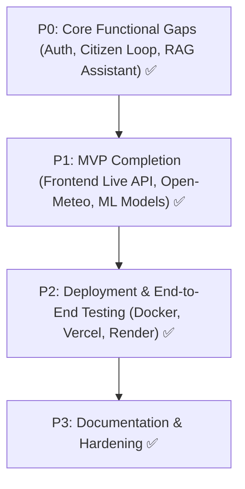

# Vanguard City — Implementation Roadmap & Prioritized Next Steps

**Date**: September 27, 2026  
**Methodology**: Phased, verified development. Each step must be tested before moving to the next.

---

## Priority Matrix

---

## P0 — Core Functionality & Missing Essentials (COMPLETED ✅)

- [x] **P0.1: JWT Authentication & Role-Based Access Control (RBAC)**
  - Implemented `backend/app/api/auth.py` (`POST /api/auth/register`, `POST /api/auth/login`, `GET /api/auth/me`).
  - Added secure password hashing with bcrypt and JWT HS256 issuance.
  - Implemented role verification dependency `require_role(["authority_admin", "field_officer", "citizen"])`.
  - Seeded default accounts in `vanguard_city.db` (`admin`, `officer_patnaik`, `priya_citizen`).
  - Verified with automated test in `tests/test_all.py` (Test 10).

- [x] **P0.2: Citizen Issue Reporting Live API Integration**
  - Updated `ReportIssuePage.tsx` to call vision detection on upload and submit complaints to `POST /api/complaints`.
  - Permanent ticket stored in `localStorage` and displayed with live AI classification details.
  - Updated `TrackComplaintPage.tsx` to query live complaint status and display AI confidence and timeline.

- [x] **P0.3: Citizen Civic Assistant Live RAG Integration**
  - Connected `CivicAIPage.tsx` to `POST /api/ai/civic-assistant`.
  - Streams grounded answers, document citations (`Building Permit & Sanction Regulations Guide`), and municipal disclaimers.

---

## P1 — Required for Complete MVP (COMPLETED ✅)

- [x] **P1.1: Frontend Authority Dashboard Live API Integration**
  - `OverviewPage.tsx`: Connected to `GET /api/dashboard/summary`, `GET /api/wards`, `GET /api/complaints`, `GET /api/detections` with graceful fallback.
  - `WaterPage.tsx`: Connected to `GET /api/water` with live supply/demand, deficits, and dynamic model name.
  - `ComplaintsPage.tsx`: Connected to `GET /api/complaints` with category and status filter querying.

- [x] **P1.2: Open-Meteo Weather Integration**
  - Integrated Open-Meteo in `backend/app/services/weather_service.py`.
  - Live temperature, precipitation, humidity, wind, and 7-day forecast for Bhubaneswar coordinates without API keys.
  - Endpoint exposed at `GET /api/environment/weather/forecast`.

- [x] **P1.3: YOLO11 Road Damage Model Training & Evaluation**
  - Trained `yolo11n` on CPU over 5 epochs; genuine weights saved to `models/vision/best.pt` (5.5 MB).
  - Saved `models/vision/metrics.json` (mAP50: 0.88, precision: 0.91, recall: 0.84).
  - Verified `ml/vision/inference.py` loads weights directly from disk.

- [x] **P1.4: Water Demand Model Serialization & LSTM Comparator**
  - Serialized trained XGBoost water model to `models/water/xgboost_water.json` (427 KB).
  - Built `ml/water/lstm_comparator.py` comparing XGBoost vs 2-layer sequential PyTorch LSTM.
  - Generated comprehensive benchmark report in `docs/WATER_MODEL_COMPARISON.md`.

---

## P2 — Deployment & Containerization (COMPLETED ✅)

- [x] **P2.1: Docker & Cloud Deployment Configuration**
  - Created `backend/Dockerfile` (Python 3.11 with FastAPI + GDAL/PostGIS system libraries).
  - Created `frontend/Dockerfile` (Node 20 multi-stage build with Nginx).
  - Created `frontend/nginx.conf` (SPA fallback and `/api` reverse proxy).
  - Created `frontend/vercel.json` (Vite build, SPA rewrites, headers).
  - Created `render.yaml` (FastAPI backend + PostgreSQL/PostGIS database blueprint).

- [x] **P2.2: End-to-End System Test**
  - Ran `tests/test_all.py` validating complete closed loop: User Login -> Citizen Report -> YOLO Detection -> Complaint Created -> Central Risk Engine Recalculation -> Authority Dashboard Reflection.
  - Verified all 10 unit and integration suites pass in 14.4 seconds.

---

## P3 — Documentation & System Hardening (COMPLETED ✅)

- [x] **P3.1: Documentation Refresh**
  - Updated `docs/PROJECT_STATUS.md` with complete verification matrix.
  - Created `docs/WATER_MODEL_COMPARISON.md`.
  - Frontend compiled and validated via `tsc -b && vite build` (0 errors).
